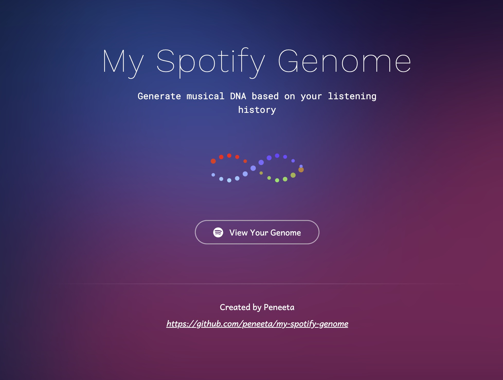
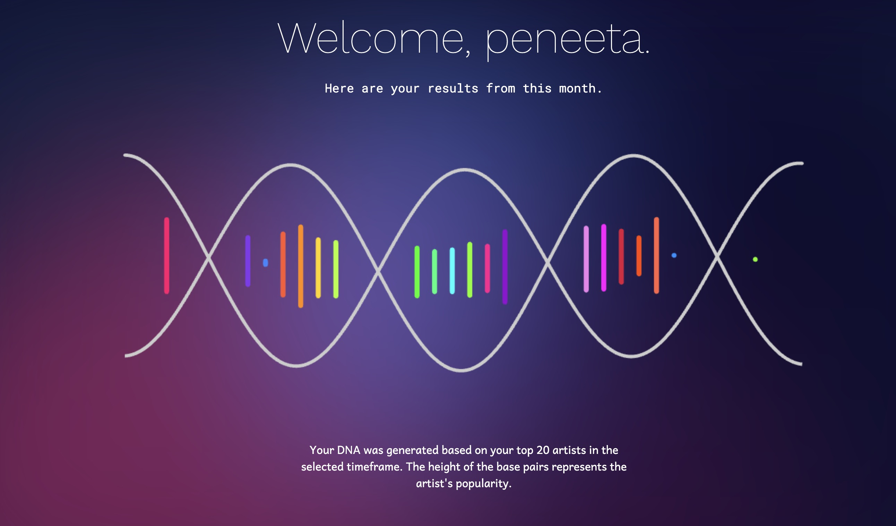

# MySpotifyGenome

Hosted at https://myspotifygenome.peneeta.com/

This project generates "musical DNA" based on a user's Spotify listening history for this past month, created with React, TypeScript, and Vite.
(Note that you have to change the API key to your own to get this to work)

## Homepage

## Example Callback

